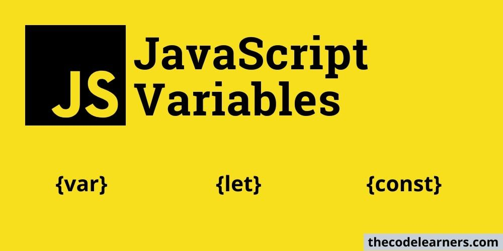
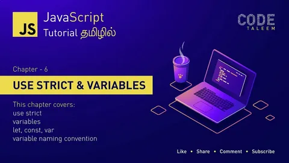
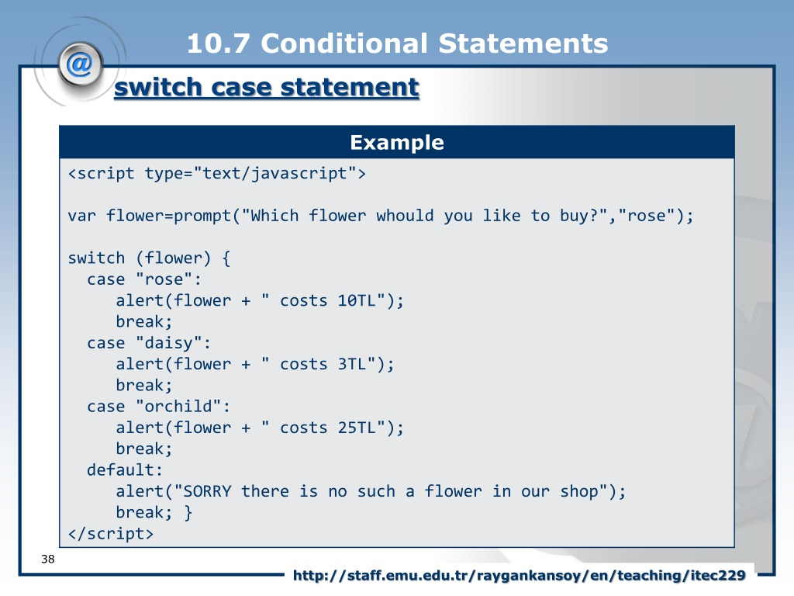

# What is JS?
## JavaScript is a popular programming 
language that has a wide range of 
applications.
JavaScript was previously used mainly for 
making webpages interactive such as form 
validation, animation, etc. Nowadays, 
JavaScript is also used in many other areas 
such as server-side development, mobile 
app development and so on.
> 

# JavaScript Variables and Constants
## In Javascript there is two types of intializing variables, var and let. You can use both of them.
However, there are some differences between them.
In programming, a variable is a container (storage area) to hold data.
If you are sure that the value of a variable won't change throughout the program, it's recommended
to use const .

var keyword is used to declare variables since JavaScript was created. It is confusing and error-prone when using variables declared using var.

let keyword removes the confusion and error of var. It is the new and recommended way of declaring variables in JavaScript.

const keyword is used to declare a constant variable that cannot be changed once assigned a value.

>
# OBJECTS AND PRIMITIVES
## PRIMITIVES
    number
    string
    boolean
    undefined
    null
    sumbol
    biglnt
>
## OBJECTS
    object literal
    arrays
    functions
    many more...

>
# Function
## function sum() {
    return 2+3;
     }
    console.log(sum());

    let sum2 =() =>{
    return 4+4;
     }
     console.log(sum2());

     let sum3 =() =>{
    return -2+4;
    }
    console.log(sum3());

    (
    function () {
        console.log('Hello World');
    }
     ) ();
    function sumNums(num){
    let a

    for(let i=1; i<=num; i++){
        a = i
    }
    return a
    }
    console.log(sumNums(10)); 

#  Using Node.js

Node.js is an open-source and cross-platform JavaScript runtime environment. It is a popular tool for almost any kind of project!

Node.js runs the V8 JavaScript engine, the core of Google Chrome, outside of the browser. This allows Node.js to be very performant.

A Node.js app runs in a single process, without creating a new thread for every request. Node.js provides a set of asynchronous I/O primitives in its standard library that prevent JavaScript code from blocking and generally, libraries in Node.js are written using non-blocking paradigms, making blocking behavior the exception rather than the norm.

When Node.js performs an I/O operation, like reading from the network, accessing a database or the filesystem, instead of blocking the thread and wasting CPU cycles waiting, Node.js will resume the operations when the response comes back.

This allows Node.js to handle thousands of concurrent connections with a single server without introducing the burden of managing thread concurrency, which could be a significant source of bugs.

Node.js has a unique advantage because millions of frontend developers that write JavaScript for the browser are now able to write the server-side code in addition to the client-side code without the need to learn a completely different language.

In Node.js the new ECMAScript standards can be used without problems, as you don't have to wait for all your users to update their browsers - you are in charge of deciding which ECMAScript version to use by changing the Node.js version, and you can also enable specific experimental features by running Node.js with flags.

# JavaScript Type Conversions

Type conversion in JavaScript is the conversion of one data type to another data type (such as string to a number, object to a boolean, and so on) which is required by the function or operator to work in the right way to give the expected results. Type conversions take place when any operation is done with different data types, these conversions can be either done by the javascript compiler or manually by us.

# Three important topics
 ## 1)  CONDITIONS
 ## 2)  LOOPS
 ## 3)  FUNCTIONS

 ##  CONDITIONS

 The if-else statement is used to execute both the true part and the false part of a given condition. If the condition is true, the if block code is executed and if the condition is false, the else block code is executed. Syntax: if(condition): #Executes this block if the condition is true else: #Executes this block if the condition is false. You should note here that. Python uses indentation in both the blocks to define the scope of the code

 ##  CONDITION Ternary operator
 Code Efficiency: It eliminates the need to execute redundant if-else checks, as the Ternary operator evaluates the condition and returns the appropriate value directly, reducing unnecessary branching in the code.
The Ternary operator in Java (condition ? expression1 : expression2) enhances code readability and quality by providing a concise shorthand for conditional statements
It involves three expressions, where the condition is evaluated, and based on the result, either expression1 or expression2 is chosen
The Ternary operator simplifies conditional assignments in a single line, improving code efficiency and readability
While the Ternary operator is a powerful tool, it's important to consider its usage alongside if-else statements, especially for handling nested conditions and more complex scenarios

## CONDITION Switch statment

The switch statement is a conditional statement (just like if.else) that allows the programmer to execute different blocks of code depending on the value of a variable. The switch statement is a more flexible version of the if-else statement because it allows the programmer to execute different blocks of code depending on the value of a variable.

## LOOP for

he for statement creates a loop that
consists of three optional expressions, 
enclosed in parentheses and separated by
semicolons, followed by a statement
(usually a block statement) to be
executed in the loop.
The following for statement starts by 
declaring the variable i and initializing it 
to 0. It checks that i is less than nine, 
performs the two succeeding statements, 
and increments i by 1 after each pass 
through the loop.

## LOOP while

The while statement creates a loop that
executes a specified statement as long as
the test condition evaluates to true. The 
condition is evaluated before executing the
statement.
The following while loop iterates as long as
n is less than three.
Note: Use the break statement to stop a 
loop before condition evaluates to true.

## LOOP Do/while
The do...while statement creates a loop
that executes a specified statement until
the test condition evaluates to false. The 
condition is evaluated after executing
the statement, resulting in the specified
statement executing at least once.
In the following example, the do...while 
loop iterates at least once and reiterates 
until i is no longer less than 5.

# FUNCTIONS

## FUNCTION Declaration
A function declaration also known as a function statement declares a function with a function keyword. The function declaration must have a function name
Function declaration does not require a variable assignment as they are standalone constructs and they cannot be nested inside a functional block
These are executed before any other code
The function in function declaration can be accessed before and after the function definition
geeksforgeeks.org
Difference between ‘function declaration’ and ‘function...
Ответ сформирован автоматически на основе информации из источника

## FUNCTION expression
The Javascript Function Expression is used to define a function inside any expression. The Function Expression allows us to create an anonymous function that doesn’t have any function name which is the main difference between Function Expression and Function Declaration. A function expression can be used as an IIFE (Immediately Invoked Function Expression) which runs as soon as it is defined.

## FUNCTION IIFE

Immediately Invoked Function Expression (IIFE) is a javascript function that is invoked just after its declaration. It is a simple function with just one strict condition, i.e., anything inside the function block must be executed immediately. This design pattern is also known as Self Executing Anonymous Function. Example:(function(){alert(' I will be executed immediately!!!');}) (); Don't worry about syntax right now.

    
